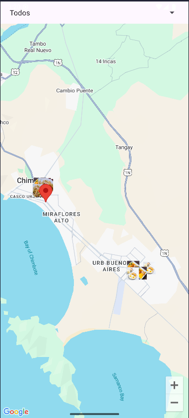
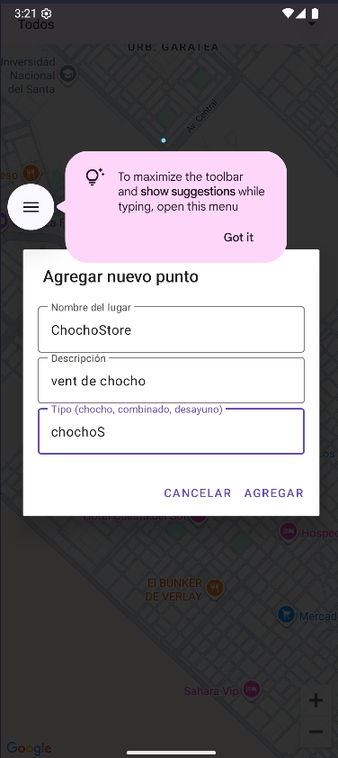
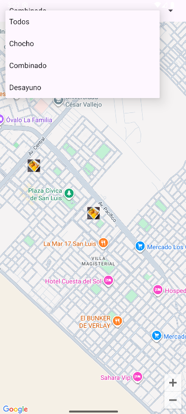

Cuchareable

app colaborativa basada en Google Maps que permite a los usuarios encontrar, agregar y valorar los mejores puntos para disfrutar de un *chocho*, un *combinado*, un buen desayuno y más delicias populares.  
Ideal para compartir y descubrir experiencias gastronómicas locales, todo de manera fácil y visual.

---

## 🚀 Demo

*Agrega aquí tus capturas de pantalla, por ejemplo:*

| Mapa inicial | Agregar punto | Filtro por tipo |
|:---:|:---:|:---:|
|  |  |  |

---

## 📱 Funcionalidades principales

- **Mapa interactivo:** Basado en Google Maps para ver y explorar puntos en tu ciudad.
- **Colaboración:** Cualquier usuario puede agregar nuevos lugares (long click en el mapa).
- **Tipos de punto:** Identifica lugares para *chocho*, *combinado*, *desayuno* y más, cada uno con su propio icono y/o color.
- **Valoraciones:** Los puntos pueden ser valorados, permitiendo ver los más populares.
- **Filtro por tipo:** Elige ver solo los lugares de un tipo específico o todos a la vez.
- **Interfaz amigable:** Diálogos y botones bonitos usando Material Design.

---

## ⚡ Cómo instalar y ejecutar el proyecto

1. **Clona este repositorio:**
   ```bash
   git clone https://github.com/PieroL1/AM_S13Cuchareable.git

2. **Abre el proyecto en Android Studio.**
3. **Configura la API Key de Google Maps:**
- **Ve a Google Cloud Console.**
- **Crea un proyecto y habilita la API de Google Maps.**
- **Copia tu API Key y pégala en tu archivo AndroidManifest.xml:**
<meta-data
    android:name="com.google.android.geo.API_KEY"
    android:value="TU_API_KEY_AQUI" />

4. **Configura Firebase:**
- **Entra a Firebase Console, crea un proyecto.**
- **Registra tu app Android con el mismo applicationId (com.example.am_s12cuchareable).**
- **Descarga el archivo google-services.json y colócalo en la carpeta /app del proyecto.**
- **Activa Firestore Database en modo de prueba mientras desarrollas.**
5. **Sincroniza dependencias Gradle.**
6. **Ejecuta la app en un emulador o dispositivo físico.**


**🛠️ Tecnologías usadas**
- **Kotlin**
- **Google Maps SDK para Android**
- **Firebase Firestore**
- **Material Components for Android**

**🗺️ Estructura general del proyecto**
- **MainActivity.kt — Carga el fragmento principal con el mapa.**
- **MapsFragment.kt — Fragmento que contiene toda la lógica del mapa, la carga de puntos y el filtrado.**
- **Layouts**
  - **activity_main.xml**
  - **fragment_maps.xml**
  - **dialog_add_point.xml**
- **Recursos**
  - **Iconos personalizados (ic_chocho.png, etc) en res/drawable/**
- **Firebase**
  - **Estructura de colección:**
puntos (Collection)
  └─ id_punto (Document)
      ├─ nombre: String
      ├─ descripcion: String
      ├─ latitud: Double
      ├─ longitud: Double
      ├─ tipo: String
      ├─ valoraciones: Int
